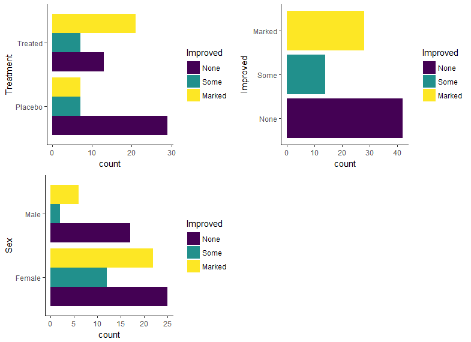
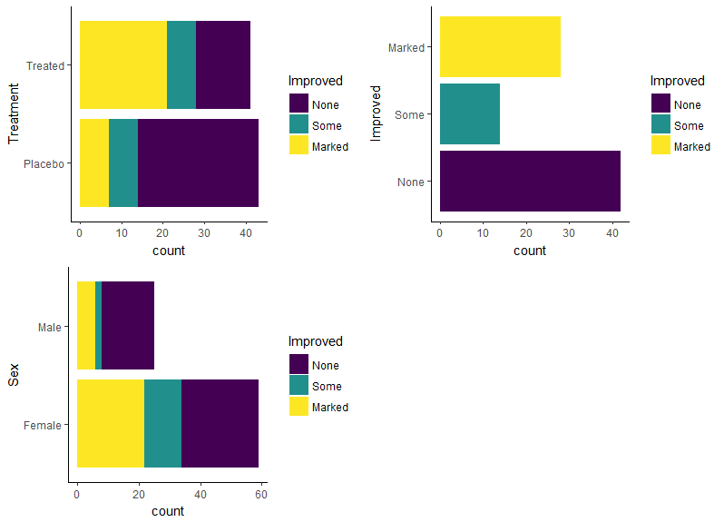
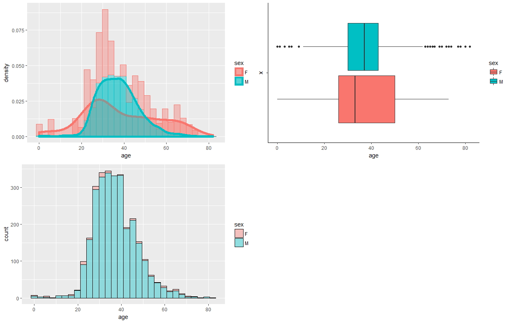
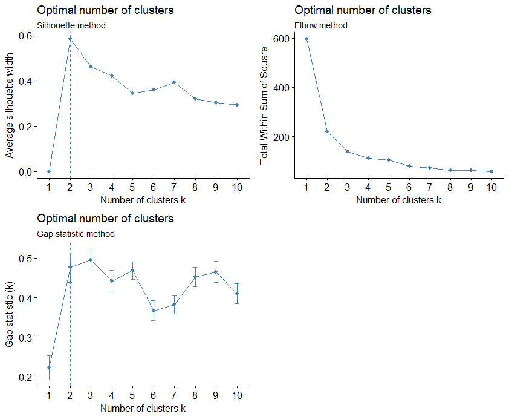

```{r setup, include=FALSE}
knitr::opts_chunk$set(
  collapse = TRUE,
  comment = "#>", 
  cache = FALSE
)
devtools::load_all()
require(knitr)
```
## AEDA - Automated Exploratory Data Analysis

This Vignette is supposed to give you a introductory glance at the key features of `AEDA`. <br>
It shows you, how to use this package to simplifies several task throughout the data exploration process. <br>
A more detailed in depth and continuously updated examples and wikipedia can be found on the GitHub project page:

* <a href="https://github.com/ptl93/AEDA" target="_blank"> AEDA Project Page </a>


### Purpose

Writing exploratory data analysis (EDA) scripts helps in extracting valuable information from the data but can be very time consuming. Often people are producing the same tables and figures again and again which could be automatized with EDA scripts. <br>
<br>
With this package we want to automate the process of creating an EDA report by providing functions which, one would normally script for each data type of dataset. Therefore we provide following functionalites:


1. [**Basic Data Summary**](#basic)
2. [**Categorical Data Summary**](#cat)
3. [**Numeric Data Summary**](#num)
4. [**Cluster Analysis**](#clust)
5. [**Principal Component Analysis**](#pca)
6. [**Multidimensional Scaling Analysis**](#mds)
7. [**Exploratory Factor Analysis**](#fa)
8. [**Correlation Analysis**](#corr)


<!--
<ol>
  <li <a href="#basicDataSummary"> <a>**Basic Data Summary** </a></li>
  <li id="catergoricalDataSummary">**Categorical Data Summary**</li>
  <li id="numericDataSummary">**Numeric Data Summary**</li>
  <li id="clusterinAnalysis">**Clustering Analysis**</li>
  <li id="pcAnalysis">**Principal Component Analysis**</li>
  <li id="mdsAnalysis">**Multidimensional Scaling Analysis**</li>
  <li id="efAnaylsis">**Exploratory Factor Analysis**</li>
</ol>
-->

In order to enable the user to either, create a fast EDA report, for the most functions we set default methods/arguments, like *k-means clustering* as method in the unsupervised clustering task. <br>
Apart from the default methods/arguments for each EDA step the user is able to modify the analysis step, by choosing other analysis algorithm. To come back to the last example, the user might also be interested in doing a hierarchical cluster analysis with *complete-linkage*. In the later subsection 4 we will refer to this again. 

The remaining of this documentation will be organized in accordance with the steps listed above. As the package evolves, more content will be added.

### General `AEDA` Pipeline
For all *analysis* steps (except) the basic data summary following steps should be executed in order to get an *analysis* into the final report:
<ol type="a">
  <li>`my.task = make*Task()`</li>
  <li>`my.analysis = make*Analysis()`</li>
  <li>`my.report = makeReport(my.analysis)`</li>
</ol>

Or since these multiple function calls do not prvide much additional
functionality there is a shortcut to get a report:
<ul style="list-style-type:none">
  `my.report = create*Report()`
</ul>
After creating several `report`-objects with `makeReport()` (e.g `cluster.report`, `numeric.report`, `mds.report`) you can pass them over to the function `finishReport(cluster.report, numeric.report, mds.report)` to create a final rmd-file which can be converted to HTML with `rmarkdown::render`

Further shortcuts are:
<ul style="list-style-type:none">
  `fastReport()` <br>
  `openMLReport()`
</ul>
`fastReport()`: Provided with a `data.frame` this function will create a finished rmd-file, which is ready to be convertetd to HTML. This function will use all available report types by default if the needed data types are available. The user can still define arguments to each report function via `m.par.vals` but since every report needs different arguments this paramter can get unhandy. <br>
`openMLReport()`: This function has the same functionality as `fastReport()` but instead of a `data.frame` it takes the ID of an [openML dataset](https://www.openml.org/search?type=data).


After creating several `report`-objects with `makeReport()` (e.g `cluster.report`, `numeric.report`, `mds.report`) you can pass them over to the function `finishReport(cluster.report, numeric.report, mds.report)`
to create a final HTML-report, which will be created with `knitr`.
>>>>>>> master

***
In the following a detailed summary for each analysis step will be displayed:


#### <a id="basic"></a> 1) Basic Data Summary

In the basic data summary column-types like `integer`, `numeric`, or `character` etc. will be identified and according to each type accumulated. In addition to that the basic data summary contains a missing value summary such as listing column which contains `NAs` with absolute and percentage amount. An example will be display with this code snippet:

```{r basicDataSummaryEx1, message=TRUE, echo=TRUE}
#load Data
data("airquality")
#create the task
basic.report.task = makeBasicReportTask(id = "airquality", data = airquality, target = "Wind")
#create the report
basic.report = makeReport(basic.report.task)
```
In order to have a look into the `basic.report`-object one can either `print()` the object or just call `basic.report` in the R-commandline.
```{r basicDataSummaryEx1ShowReportObj, echo=TRUE}
print(basic.report)

#To gain more insights you can look into the object with the $ operator:
basic.report$basic.data.summary$basic.summary.list$num
basic.report$basic.data.summary$basic.summary.list$int
basic.report$basic.data.summary$basic.summary.list$fact
```

Since the `airquality` dataset contains `NAs`, a missing value analysis is calculated as well by `makeBasicReportTask`. In order to look into the that simply use the `$`-Operator again:

```{r basicDataSummaryEx1ShowNADF, echo=TRUE}
basic.report$na.summary$na.df

#kable(basic.report$na.summary$na.df)
```
We provide 2 Missing-Value Plots. The first one shows the index of observation in which the value is missing for each column. The second one shows an overall percentage of missing value for each column.
To call the plots you can execute following lines:
`basic.report$na.summary$image()`and `basic.report$na.summary$ggplot`

```{r uploadbarNAPlots, echo=FALSE, out.width="45%"}
include_graphics(c("images/NAindex.png", "images/NApct.png"))
```

<!--
```{r basicDataSummaryEx1ShowPlot1, echo=TRUE, fig.cap="Missing Value Plot Index", out.width="40%"}
basic.report$na.summary$image()
```
```{r basicDataSummaryEx1ShowPlot2, echo=TRUE, fig.cap="Missing Value Plot Percentage", out.width="40%"}
basic.report$na.summary$ggplot
```
-->


#### <a id="cat"></a> 2) Categorical Data Summary

In the categorical data summary 1-D frequency tables and 2-D contingency tables for categorical variables will be calculated. In addition to that, the internal function `plotBar()`from our package computes a `ggplot` for all categorical variables. The user is able to modify the `geom_bar()` arguments if wanted in within the task initialized by `makeCatSumTask()`.
For more Information look at `?makeCatSumTask`. <br> 
In this example we use the default arguments.

```{r CategeoricalDataSummaryEx, echo=TRUE}
#load data
data("Arthritis", package = "vcd")
#create the task
cat.sum.task = makeCatSumTask(id = "Arthritis.Task", data = Arthritis, target = "Improved")
#compute the analysis
cat.sum.analysis = makeCatSum(cat.sum.task)
#create the report
cat.sum.report = makeReport(cat.sum.analysis)

#have a look at the 1-D absolute frequency tables
cat.sum.report$cat.sum$freq

#have a look at the 2-D absolute contingecy tables
cat.sum.report$cat.sum$contg.list
```

To access the bar plots we can use the `$`-operator again. Note that in our package we have the internal function `multiplot()` which can plot a `list` of `ggplot`-objects in a grid. To call the `multiplot()` function simply run: `multiplot(plotlist = cat.sum.report$cat.sum$plot.list, cols = 2)` which leads to following plot:

```{r uploadbarPlot1, echo=FALSE, out.width="80%"}
 
```

Since we can add `geom_bar` arguments into the `makeCatSumTask` the user can modify the barplot. For example we stack the frequency for a categorical variable instead of dodging it. This can be easily done by the same procedure as the example above, with just one additional parameter:
`cat.sum.task = makeCatSumTask(id = "Arthritis.Task", data = Arthritis, target = "Improved", position = "stack")` leading to the following image after using `multiplot()` :

```{r uploadbarPlot2, echo=FALSE, out.width="80%"}
 
```


#### <a id="num"></a> 3) Numeric Data Summary

In the numeric data summary we create a numeric summary data.frame which provides several characteristics for each numeric column. Furthermore for each numeric column a boxplot, histogramm and kernel density plot will be created. In order to to get the numeric report the user must run following functions: 

```{r NumericDataSummaryEx, echo=TRUE}
#load data
data("Aids2", package = "MASS")
#create the task
num.sum.task = makeNumSumTask(id = "AidsTask", data = Aids2, target = "sex")
#compute the analysis
num.sum = makeNumSum(num.sum.task)
#create the report
num.sum.report = makeNumSumReport(num.sum)
```

In order to call the numeric summary data.frame execute `num.sum.report$num.sum.df`. <br>
The characteristics we calculated are:

```{r NumericDataSummaryDF, echo=TRUE}
colnames(num.sum.report$num.sum.df)
```

Showing the result after selecting specific columns we receive:
```{r NumericDataSummaryDFKable, echo=TRUE}
kable(num.sum.report$num.sum.df[, c(1,2,4,5,6,7,8,10,12,13,14,16,21,22)])
```

* The sample kurtosis will be calculated via $\frac{1}{n}\sum_{i=1}^{n}(\frac{x_i - \bar{x}}{s})^4$
* The sample skewness will be calculated via
$\frac{1}{n}\sum_{i=1}^{n}(\frac{x_i - \bar{x}}{s})^3$
* `l.bound` is defined as `5% - 1.5*IQR` and `u.bound` is defined as `75% + 1.5*IQR` where `IQR = 75% - 25%`

To show the `ggplot`-objects for a variable, e.g `age` with multiplot it can be done in one grid:
`multiplot(plotlist = num.sum.report$num.sum.var$age[2:4], cols = 2)`
leading to the following plot:

```{r uploadNumericPlot1, echo=FALSE, out.width="80%"}
 
```

Just like the `makeCatSumTask` in the numeric summary the user can change input parameters for `geom_density()`, `geom_box` or `geom_histogramm()`. with `task = makeNumSumTask(id = "AidsTask", data = Aids2, target = "sex", geom.hist.args = list(bins = 20, alpha = 0.5))`.


#### <a id="clust"></a> 4) Cluster Analysis


Cluster analysis is a unsupervised learning task, which mainly focuses on grouping a set of objects in such a way that objects in the same group (called a cluster) are more similar (in some sense) to each other than to those in other groups (clusters). Cluster analysis itself is not one specific algorithm, but the general task to be solved. It can be achieved by various algorithms that differ significantly in their notion of what constitutes a cluster and how to efficiently find them. Inspired by <a href="http://mlr-org.github.io/mlr-tutorial/devel/html/integrated_learners/index.html#cluster-analysis-9" target="_blank"> mlr's listed clustering algorithms</a> our packages provides following clustering methods:

1. For Hierarchical Clustering:
 + <a href="https://stat.ethz.ch/R-manual/R-devel/library/stats/html/hclust.html" target="_blank">Classical hierarchical clustering</a>
 + <a href="https://www.rdocumentation.org/packages/cluster/versions/2.0.6/topics/agnes" target="_blank">Agglomerative nesting</a>
 + <a href="https://www.rdocumentation.org/packages/cluster/versions/2.0.7/topics/diana" target="_blank">Divisive analysis</a>
 
2. For Partitioning Clustering:
 + <a href="https://www.rdocumentation.org/packages/stats/versions/3.4.3/topics/kmeans" target="_blank">K-nearest-neighbors</a>
 + <a href="https://www.rdocumentation.org/packages/kernlab/versions/0.9-25/topics/kkmeans" target="_blank">Kernel K-means</a>
 + <a href="https://www.rdocumentation.org/packages/cluster/versions/2.0.7/topics/pam" target="_blank">Partioning around medoids</a>
 
3. For Model-Based Clustering:
 + <a href="https://www.rdocumentation.org/packages/dbscan/versions/1.0-0/topics/dbscan" target="_blank">Density-based spatial clustering</a>
 + <a href="https://www.rdocumentation.org/packages/mclust/versions/5.4/topics/Mclust" target="_blank">Model-based clustering</a>

By default in the cluster analysis **k-means** clustering will be computed on the numeric columns of a dataset. 
The components of the `ClusterAnalysisObj` are the following: (in case the method is **not hierarchical**)
<br>

<ul>
<li>**`cluster.all`**: considers all numeric columns of a dataset
<ul>
<li>`cluster.diag`: a cluster diagnosis depending on the selected algorithm</li>
<li>`cluster.res`: the cluster result for a selected algorithm</li>
<li>`cluster.plot`: a plot to the computed cluster</li>
</ul>
</li>
<li>**`comb.cluster.list`**: considers up to 10 tuple-combinations of numeric columns
<ul>
<li>`cluster.diag`: a cluster diagnosis depending on the selected algorithm</li>
<li>`cluster.res`: the cluster result for a selected algorithm</li>
<li>`cluster.plot`: a plot to the computed cluster</li>
</ul>
</li>
</ul>

The **`comb.cluster.list`** has the purpose to create clusters and grouping relationships between 2 numeric variables. The list is restricted up to 10 cluster analysis. If a dataset contains of 3 numeric columns, there are $\binom{4}{2} =$ `r choose(4,2)` combinations. If the tuple-combinations is above 10, out of the $\binom{k}{2}$ combinations, our function randomly selects 10 of it. <br>
In case of a **hierarchical clustering algorithmus** the `comb.cluster.list` is an empty list, since the calculation will be done with respect to *all numeric columns* only.

Following code snippets are needed in order to create a cluster analysis report:

```{r clusterAnalysisEx1, echo=TRUE}
#create the task
cluster.task = makeClusterTask(id = "iris", data = iris)
#compute the analysis
cluster.analysis = makeClusterAnalysis(cluster.task)
#create the report
cluster.report = makeReport(cluster.analysis)
#cluster.report = readRDS("cache/clusterEx1.Rds")
```

Plotting the diagnosis results for the `cluster.all` section can be done via:
`multiplot(plotlist = cluster.report$cluster.analysis$cluster.all$cluster.diag, cols = 2)` leading to the diagnos plot:

```{r uploadclusterAllDiag1, echo=FALSE, out.width="80%"}
 
```

Since the iris dataset contains of 4 numeric columns, the 2 cluster centers $c_1$ and $c_2$ are $\in \mathbb{R}^4$.

```{r showClusterAllRes, echo=TRUE, fig.dim=c(5,5)}
#show centers
cluster.report$cluster.analysis$cluster.all$cluster.res$centers

#show plot: Note, before a principal component analysis was conducted in order to map the centers and points into 2 dimensional space
cluster.report$cluster.analysis$cluster.all$cluster.plot
```

In case the user wants to perform hierarchical clustering, he can simply choose one of the methods, our function provides:

```{r clusterAnalysisEx2, echo=TRUE, fig.dim=c(7,5)}
##check available methods
#?makeClusterTask
#create the task: hierarchical clustering with average linkage.
cluster.task.2 = makeClusterTask(id = "iris", data = iris, method = "cluster.h",
  par.vals = list(method = "average"))
#compute the analysis
cluster.analysis.2 = makeClusterAnalysis(cluster.task.2)
#cluster.analysis.2 = readRDS("cache/clusterEx2.Rds")
#we do not need to create the report, as cluster.analysis.2 already contains the analysis information. If we were to include the cluster.analysis.2 into our final report, then we would have to create the report.

#multiplot one diagnosis plot and the resulting dendogramm
multiplot(plotlist = list(cluster.analysis.2$cluster.analysis$cluster.all$cluster.plot,
  cluster.analysis.2$cluster.analysis$cluster.all$cluster.diag[[2]]), cols = 2)
```

In order to gain more insights into the cluster analysis for all numeric columns you can access `cluster.report$cluster.analysis$cluster.all$cluster.res$`. Since the user can specify the algorithm, the returned values differ for each method. The links for the the cluster clustering algorithm choices forward you to the respective methods in order to have a look at the returned values.


#### <a id="pca"></a> 5) Principal Component Analysis

Principial Component Analysis (PCA) is a dimensionality reduction method that uses an an orthogonal transformation to reduce a large set of (numeric) variables to a small set of (numeric) variables, called principal components, that still contain most of the information of the large set. Those computed principal components are linearely independent, and hence uncorrelated. <br>

The first principal component accounts for as much of the variability/variance in the data as possible, and each succeeding component accounts for as much of the remaining variability/variance as possible.

Following code snippets are needed in order to create a principal component analysis report:

```{r pcaEx1, echo=TRUE, fig.dim = c(8,5)}
#create the task
pca.task = makePCATask(id = "iris", data = iris, target = NULL)
#compute the analysis
pca.result = makePCA(pca.task)
#create the report
pca.report = makeReport(pca.result)

#show scree- and scatterplot:
multiplot(plotlist = list(scree = pca.report$pca.result$plotlist$pca.scree,
  scatter = pca.report$pca.result$plotlist$pca.scatter.1), cols = 2L)
```

In order to gain more insights into the principal component analysis you can either access `pca.result` or `pca.report`. For the sake of consistency one can extract the standard deviations of the principal components via:
`pca.report$pca.result$pca.result$sdev` or the (weighting) loadings via `pca.report$pca.result$pca.result$rotation`.
For more information have a look at the returned values by <a <href="http://stat.ethz.ch/R-manual/R-devel/library/stats/html/prcomp.html" target="_blank">stats::prcomp()</a>.


#### <a id="mds"></a> 6) Multidimensional Scaling Analysis

Multidimensional scaling (MDS) is a **visual representation of distances or dissimilarities between sets of objects**. Objects can be colors, faces, map coordinates, political persuasion, or any kind of real conceptual stimuli <a href="https://books.google.de/books/about/Multidimensional_Scaling.html?id=ZzmIPcEXPf0C&redir_esc=y" target="_blank">(Kruskal and Wish, 1978)</a>.
Objects that are more similar (or have shorter distances) are closer together on the graph than objects that are less similar (or have linger distances). As well as interpreting dissilarities as distances on a graph, MDS can also serve as a dimension reduction technique for high-dimensional data. An MDS algorithm aims to place each object in $K-$dimensional space such that the between-object distances are preserved as well as possible. In our approach we set $K = 2$ in order to create a two-dimensional scatterplot to represent the objects.

Our MDS-report provides following MDS algorithms:

1. For Metric Scaling:
 + <a href="https://www.rdocumentation.org/packages/stats/versions/3.4.3/topics/cmdscale" target="_blank">Classical multidimensional scaling</a>
 + <a href="https://www.rdocumentation.org/packages/vegan/versions/2.4-2/topics/wcmdscale" target="_blank">Weighted classical multidimensional scaling</a>
 + <a href="https://cran.r-project.org/web/packages/smacof/vignettes/smacof.pdf" target="_blank">Multidimensional scaling on a symmetric dissimilarity matrix using SMACOF</a>
 
2. For Non-Metric Scaling:
 + <a href="https://www.rdocumentation.org/packages/MASS/versions/7.3-47/topics/isoMDS" target="_blank">Kruskal's Non-metric Multidimensional Scaling</a>
 + <a href="https://www.rdocumentation.org/packages/cluster/versions/2.0.7/topics/pam" target="_blank">Sammon's Non-Linear Mapping</a>

Following code snippets are needed in order to create a multidimensional scaling report:

```{r MDSEx1, echo=TRUE, fig.dim=c(6,6)}
#create the task
mds.task = makeMDSTask(id = "mtcars", data = mtcars)
#compute the analysis
mds.analysis = makeMDSAnalysis(mds.task)
#create the report
mds.report = makeReport(mds.analysis)

#after computing the distances from following dataframe
head(mtcars)

#we map the objects (cars) based on dist(mtcars) back into 2-dimensional space
head(mds.report$mds.analysis$mds.result)

#Plot the MDS results
mds.report$mds.analysis$mds.plot
```

In order to gain more insights into the multidimensional scaling analysis you can access `mds.report.mds.anylsis`. Since the user can specify the algorithm, the returned values differ for each method. The links for the metric and non-metric forward you to the respective methods in order to have a look at the returned values.


#### <a id="fa"></a> 7) Exploratory Factor Analysis

Factor analysis is a way to describe variability among observed, correlated variables in terms of a potentially lower number of unobserved variables, called **factors**. <br>
Like principal component analysis as well as multidimensional scaling its purpose is dimension reduction. It's a way to find hidden patterns, show how those patterns overlap and show what characteristics are seen in multiple patterns.
These **factors** each embody a set of **observed variables** that have similar response patterns. Our `makeFAReport` computes an exploratory factor analysis, since in the very beginning of the analysis we believe to not have any idea about what structure the data is or how many dimensions are in a set of variables. 
<br> 
<br>
Since we do not specify the number of factors, by `default` our function computes the optimal number of factors according to the <a href="https://www.rdocumentation.org/packages/psych/versions/1.8.3.3/topics/fa.parallel" target="_blank">parallel analysis</a>, A technique that compares the scree of factors of the observed data with that of a random data matrix of the same size as the original. If the user selects the number of factors, the computation will be done with the assigned number of factors.

Following code snippets are needed in order to create a factor analysis report:

```{r faEx, echo=TRUE, fig.dim=c(6,6)}
#load data
library(psych)
data(bfi)
#take small sample of size 200L:
bfi.small = bfi[sample(seq_len(nrow(bfi)), size = 200L), ]
#create the task
fa.task = makeFATask(id = "bfi", data = bfi.small)
#compute the analysis
fa.result = makeFA(fa.task)
#create the report
fa.report = makeReport(fa.result)
#Plot the factor analysis results 
fa.diagram(fa.report$fa.result)
```

In order to gain more insights into the exploratory factor analysis you can either access `fa.result` or `fa.report` object. For the sake of consistency we will show an example with the report object.
One can extract the loadings of thefactor analysis via:
`fa.report$fa.result$Structure`.
For more information have a look at the returned values by <a <href="https://www.rdocumentation.org/packages/psych/versions/1.7.8/topics/fa" target="_blank">psych::fa()</a>.

#### <a id="corr"></a> 8) Correlation Analysis
Correlation describes the relationship between two features. Depending on the used method num and ordered features can be used in the analysis. The default option is to use all suitable features, but the user can specify which columns should be included. <br>
The resulting correlation matrix is calculated with the `base::cor`

```{r CorrEx, echo=TRUE}
data("survey", package = "MASS")
# Since Exer and Smoke are ordinal, encode them as ordered
survey$Exer = factor(survey$Exer,levels(survey$Exer)[c(2,3,1)], ordered = TRUE)
survey$Smoke = factor(survey$Smoke,levels(survey$Smoke)[c(2,3,4,1)], ordered = TRUE)

#create the task
corr.task = makeCorrTask(id = "survey", data = survey)
#compute the analysis
corr.result = makeCorr(corr.task)
#create the report
corr.report = makeReport(corr.result)

#default method is "pearson"
corr.report$method
#print the correlation matrix
corr.report$corr.matrix
```
The correlation report will create a circle shaped correlation plot:

```{r CorrPlot, echo=FALSE, warning=FALSE, fig.height=2.5, fig.width=4}
library(GGally)
ggcorr(data = NULL, cor_matrix = corr.report$corr.matrix, 
geom = "circle", nbreaks = 10)
```

To include the ordered features use the method `spearman` or `kendall`:

```{r SCorrEx, echo=TRUE}
# As mentioned there is shortcut to get a report
s.corr.report = createCorrReport(data = survey, method = "spearman")

#method is now ...
s.corr.report$method
#correlation matrix includes ordered features
s.corr.report$corr.matrix
```

The resulting plot:

```{r SCorrPlot, echo=FALSE, fig.height=3, fig.width=6}
ggcorr(data = NULL, cor_matrix = s.corr.report$corr.matrix, 
geom = "circle", nbreaks = 10)
```
